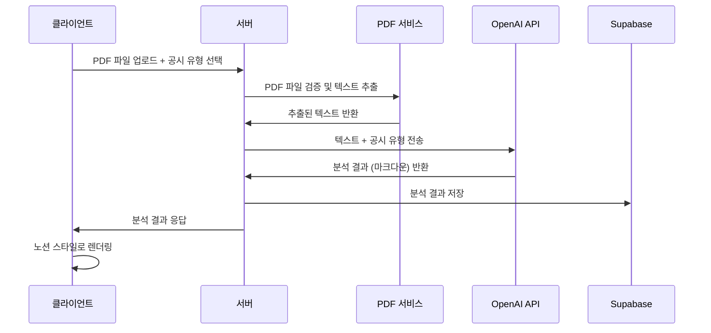

# Dartify 아키텍처 문서

## 개요

Dartify는 기업의 전자공시(DART) 자료를 AI 기반으로 분석하여 인사이트를 제공하는 공시 분석 자동화 플랫폼입니다. 이 문서는 Dartify의 시스템 아키텍처, 데이터 플로우, 컴포넌트 구조를 상세히 설명합니다.

---

## 시스템 아키텍처 개요

### 전체 시스템 구조
```
┌─────────────────┐    ┌─────────────────┐    ┌─────────────────┐
│   Frontend      │    │   Backend       │    │   External      │
│   (Client)      │◄──►│   (Server)      │◄──►│   Services      │
└─────────────────┘    └─────────────────┘    └─────────────────┘
│                 │    │                 │    │                 │
│ • HTML/CSS/JS   │    │ • Express.js    │    │ • OpenAI API    │
│ • Notion Style  │    │ • Multer        │    │ • Supabase      │
│ • Responsive    │    │ • PDF Parse     │    │ • Font Awesome  │
└─────────────────┘    └─────────────────┘    └─────────────────┘
```

### 기술 스택
- **Frontend**: Vanilla JavaScript, HTML5, CSS3
- **Backend**: Node.js, Express.js
- **Database**: Supabase (PostgreSQL)
- **AI Service**: OpenAI API (GPT-4)
- **File Processing**: pdf-parse, multer
- **Styling**: Custom CSS with Notion-style design

---

## 상세 아키텍처

### 1. 프론트엔드 아키텍처

#### 파일 구조
```
public/
├── index.html          # 메인 HTML 파일
├── css/
│   ├── style.css       # 메인 스타일시트
│   └── notion-style.css # 노션 스타일 분석 결과
├── js/
│   └── app.js          # 클라이언트 JavaScript
└── images/             # 이미지 자산
```

#### 주요 컴포넌트
- **파일 업로드 영역**: 드래그 앤 드롭 지원
- **공시 유형 선택**: 드롭다운 기반 선택
- **로딩 애니메이션**: 단계별 진행 표시
- **결과 표시**: 노션 스타일 마크다운 렌더링

### 2. 백엔드 아키텍처

#### 디렉토리 구조
```
src/
├── app.js                 # 메인 서버 파일
├── config/
│   └── supabase.js        # Supabase 설정
├── controllers/
│   └── analysisController.js # 분석 컨트롤러
├── services/
│   ├── openaiService.js   # OpenAI API 서비스
│   ├── pdfService.js      # PDF 처리 서비스
│   └── markdownService.js # 마크다운 처리 서비스
├── routes/
│   └── analysisRoutes.js  # API 라우트
├── models/
│   └── disclosureTypes.js # 공시 유형 모델
├── middleware/            # 미들웨어 (향후 확장)
└── utils/                 # 유틸리티 함수 (향후 확장)
```

#### 서버 구성
- **Express.js**: 웹 프레임워크
- **CORS**: 크로스 오리진 리소스 공유
- **Multer**: 파일 업로드 처리
- **dotenv**: 환경 변수 관리

---

## 데이터 플로우

### 1. 문서 분석 플로우



### 2. 상세 처리 단계

#### 1단계: 파일 업로드 및 검증
```javascript
// 파일 검증
- PDF 파일 형식 확인
- 파일 크기 제한 (10MB)
- 보안 검사 (악성 파일 방지)
```

#### 2단계: PDF 텍스트 추출
```javascript
// 텍스트 추출 프로세스
- pdf-parse 라이브러리 사용
- 기본 텍스트 추출 (OCR 비활성화)
- 텍스트 길이 제한 (5000자)
- 텍스트 정리 및 정규화
```

#### 3단계: AI 분석
```javascript
// OpenAI API 호출
- 프롬프트 ID 기반 분석
- 공시 유형별 맞춤 프롬프트
- 토큰 제한 관리 (200,000 토큰)
- 마크다운 형식 결과 반환
```

#### 4단계: 결과 처리
```javascript
// 결과 후처리
- 마크다운 유효성 검사
- Supabase에 결과 저장
- 클라이언트에 응답 전송
```

---

## 컴포넌트 상세 분석

### 1. 컨트롤러 (Controllers)

#### AnalysisController
```javascript
class AnalysisController {
  async analyzeDocument(req, res)     // 문서 분석 메인 함수
  async convertMarkdownToHTML(req, res) // 마크다운 변환
  async getAnalysisHistory(req, res)  // 분석 기록 조회
  async getDisclosureTypes(req, res)  // 공시 유형 조회
  async updatePDFSettings(req, res)   // PDF 설정 업데이트
}
```

**주요 기능:**
- 파일 업로드 처리
- PDF 검증 및 텍스트 추출
- OpenAI API 호출
- 결과 저장 및 응답

### 2. 서비스 레이어 (Services)

#### OpenAIService
```javascript
class OpenAIService {
  constructor()                    // OpenAI 클라이언트 초기화
  truncateText(text, maxTokens)    // 텍스트 길이 제한
  estimateTokenCount(text)         // 토큰 수 추정
  analyzeDocument(text, type, specificType) // 문서 분석
}
```

**주요 기능:**
- OpenAI API 연동
- 토큰 제한 관리
- 프롬프트 최적화
- 에러 처리

#### PDFService
```javascript
class SimplePDFService {
  constructor()                    // PDF 서비스 초기화
  parsePDF(filePath)              // PDF 파싱
  extractBasicText(filePath)      // 기본 텍스트 추출
  validatePDF(file)               // PDF 검증
  cleanText(text)                 // 텍스트 정리
}
```

**주요 기능:**
- PDF 파일 파싱
- 텍스트 추출
- 파일 검증
- OCR 지원 (현재 비활성화)

#### MarkdownService
```javascript
class MarkdownService {
  validateMarkdown(markdown)       // 마크다운 유효성 검사
  convertToHTML(markdown)          // HTML 변환
  sanitizeHTML(html)               // HTML 정리
}
```

**주요 기능:**
- 마크다운 유효성 검사
- HTML 변환
- 보안 정리

### 3. 데이터 모델 (Models)

#### DisclosureTypes
```javascript
// 공시 유형 정의
const disclosureTypes = {
  regular: {
    name: "정기공시",
    types: ["사업보고서", "반기보고서", "분기보고서"]
  },
  major: {
    name: "주요사항보고서", 
    types: ["주식관련", "채무관련", "경영관련"]
  }
  // ... 기타 유형들
}
```

### 4. 데이터베이스 스키마

#### analysis_results 테이블
```sql
CREATE TABLE analysis_results (
    id SERIAL PRIMARY KEY,
    filename VARCHAR(255) NOT NULL,
    disclosure_type VARCHAR(100) NOT NULL,
    specific_type VARCHAR(100) NOT NULL,
    analysis_result TEXT NOT NULL,
    file_size BIGINT NOT NULL,
    pages INTEGER DEFAULT 1,
    created_at TIMESTAMP WITH TIME ZONE DEFAULT NOW(),
    updated_at TIMESTAMP WITH TIME ZONE DEFAULT NOW()
);
```

**인덱스:**
- `idx_analysis_results_created_at`: 생성일 기준 정렬
- `idx_analysis_results_disclosure_type`: 공시 유형 검색
- `idx_analysis_results_filename`: 파일명 검색

---

## API 엔드포인트

### 1. 분석 관련 API

#### POST `/api/analysis/analyze`
```javascript
// 문서 ���석
Request:
- file: PDF 파일 (multipart/form-data)
- disclosureType: 공시 유형 (string)
- specificType: 세부 유형 (string)

Response:
{
  success: boolean,
  result: string, // 마크다운 형식
  format: "markdown",
  metadata: {
    filename: string,
    pages: number,
    fileSize: number
  }
}
```

#### POST `/api/analysis/convert-markdown`
```javascript
// 마크다운을 HTML로 변환
Request:
{
  markdown: string
}

Response:
{
  success: boolean,
  html: string
}
```

#### GET `/api/analysis/history`
```javascript
// 분석 기록 조회
Response:
{
  success: boolean,
  data: [
    {
      id: number,
      filename: string,
      disclosure_type: string,
      created_at: string
    }
  ]
}
```

#### GET `/api/analysis/disclosure-types`
```javascript
// 공시 유형 조회
Response:
{
  success: boolean,
  data: object // 공시 유형 구조
}
```

---

## 보안 아키텍처

### 1. 파일 업로드 보안
```javascript
// 파일 검증
- PDF 파일 형식만 허용
- 파일 크기 제한 (10MB)
- 파일명 중복 방지
- 임시 파일 자동 정리
```

### 2. API 보안
```javascript
// CORS 설정
- 특정 도메인만 허용
- Credentials 지원
- 요청 크기 제한
```

### 3. 데이터베이스 보안
```sql
-- Row Level Security (RLS)
- 테이블별 접근 정책
- 인증된 사용자만 접근
- 자동 업데이트 트리거
```

---

## 성능 최적화

### 1. 프론트엔드 최적화
- **CSS 최적화**: Critical CSS 인라인
- **JavaScript 최적화**: 코드 분할 및 지연 로딩
- **이미지 최적화**: WebP 포맷 사용

### 2. 백엔드 최적화
- **PDF 처리**: 텍스트 길이 제한
- **API 호출**: 토큰 제한 관리
- **데이터베이스**: 인덱스 최적화

### 3. 캐싱 전략
- **정적 파일**: 브라우저 캐싱
- **API 응답**: Redis 캐싱 (향후 구현)
- **PDF 메타데이터**: 메모리 캐싱

---

## 확장성 고려사항

### 1. 수평 확장
- **로드 밸런서**: 다중 서버 지원
- **세션 관리**: Redis 기반 세션
- **파일 저장**: 클라우드 스토리지 (S3)

### 2. 마이크로서비스 아키텍처
```javascript
// 향후 분리 가능한 서비스들
- PDF Processing Service
- AI Analysis Service
- User Management Service
- Notification Service
```

### 3. 데이터베이스 확장
- **읽기 전용 복제본**: 쿼리 성능 향상
- **파티셔닝**: 대용량 데이터 처리
- **백업 전략**: 자동 백업 및 복구

---

## 모니터링 및 로깅

### 1. 로깅 전략
```javascript
// 로그 레벨
- ERROR: 시스템 오류
- WARN: 경고 사항
- INFO: 일반 정보
- DEBUG: 디버깅 정보
```

### 2. 모니터링 지표
- **성능 지표**: 응답 시간, 처리량
- **오류 지표**: 오류율, 오류 유형
- **사용자 지표**: 활성 사용자, 사용 패턴

### 3. 알림 시스템
- **오류 알림**: Slack/Email 연동
- **성능 알림**: 임계값 초과 시 알림
- **용량 알림**: 디스크/메모리 부족 시 알림

---

## 배포 아키텍처

### 1. 개발 환경
```javascript
// 로컬 개발
- Node.js 개발 서버
- Supabase 로컬 개발
- 환경 변수 관리 (.env)
```

### 2. 스테이징 환경
```javascript
// 테스트 환경
- 클라우드 호스팅 (Vercel/Heroku)
- 테스트 데이터베이스
- CI/CD 파이프라인
```

### 3. 프로덕션 환경
```javascript
// 운영 환경
- 클라우드 인프라 (AWS/GCP)
- 로드 밸런서
- 자동 스케일링
- 백업 및 복구
```

---

## 장애 대응 및 복구

### 1. 장애 유형별 대응
- **서버 장애**: 자동 재시작
- **데이터베이스 장애**: 백업에서 복구
- **외부 API 장애**: 폴백 메커니즘

### 2. 백업 전략
- **데이터베이스**: 일일 자동 백업
- **파일**: 클라우드 스토리지 백업
- **설정**: 버전 관리 시스템

### 3. 복구 절차
- **RTO (Recovery Time Objective)**: 4시간
- **RPO (Recovery Point Objective)**: 24시간
- **테스트**: 정기적인 복구 테스트

---

## 향후 개발 계획

### 1. 단기 계획 (1-3개월)
- [ ] 사용자 인증 시스템
- [ ] 분석 결과 내보내기 기능
- [ ] 성능 모니터링 도구

### 2. 중기 계획 (3-6개월)
- [ ] 마이크로서비스 아키텍처 전환
- [ ] 실시간 알림 시스템
- [ ] 고급 분석 기능

### 3. 장기 계획 (6개월 이상)
- [ ] AI 모델 자체 개발
- [ ] 다국어 지원
- [ ] 모바일 앱 개발

---

이 아키텍처 문서는 Dartify 시스템의 현재 상태를 반영하며, 향후 개발 방향과 확장 계획을 제시합니다. 모든 개발 결정은 이 문서를 참조하여 일관성과 확장성을 보장해야 합니다.